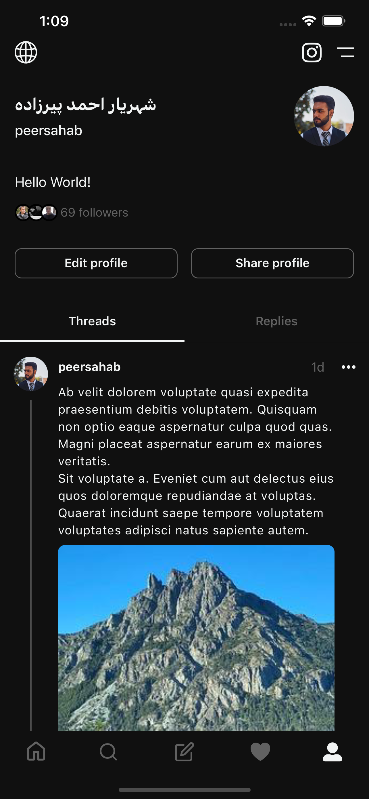

# Threads Clone

A simple Threads clonne built with React Native and Expo.

(Search and Activity Screens are not implemented)

## Installation Instructions

To run the app on your device, follow these steps:

1. Make sure you have Expo Go installed on your device (SDK 49). You can download it from the [App Store](https://apps.apple.com/us/app/expo-go/id982107779) or [Google Play](https://play.google.com/store/apps/details?id=host.exp.exponent&hl=en&gl=US).

2. Clone this repository to your local machine.

3. Open a terminal or command prompt and navigate to the project's root directory.

4. Run the following command to install the required dependencies:
   ```shell
   npm install
   ```
   or
   ```shell
   yarn install
   ```

5. Make sure your device and laptop are connected to the same Wi-Fi network.

6. Run the following command to start the Expo server:
   ```shell
   npx expo start
   ```

7. Once the Expo server is running, open the Expo Go app on your device.

8. On the main screen of the Expo Go app, you should see the running project listed. If not, follow the next step.

9. Use the Expo Go app to scan the QR code displayed in the terminal or Expo Dev Tools. This will start building the app on your device.

10. Wait for the build process to complete, and the app should launch on your device.

## Screenshots
### Home


### New Thread


### Profile

